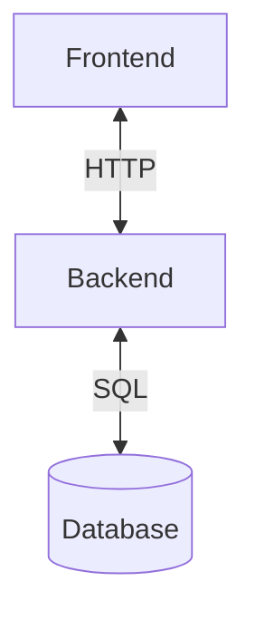
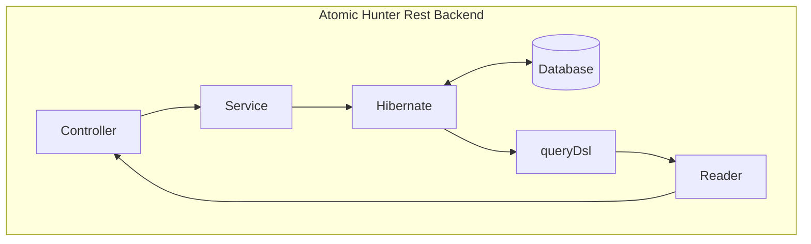
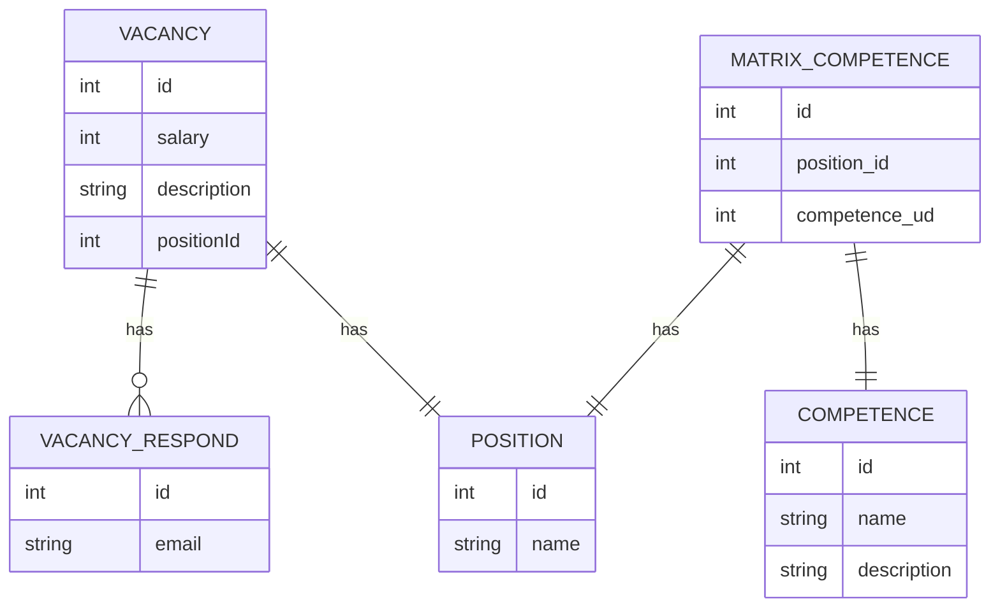

# Техническое описание системы

Система **Atomic Hunter** разработана в соответствии с трёхзвенной архитектурой. Данная система включает в себя клиентское веб-приложение и сервис, которые разработаны с помощью решений с открытым исходным кодом. Веб-приложение разработано c помощью веб-фреймворка **Angular 15**. Серверная часть представляет собой сервис, разработанный с помощью **Java 17** и фреймворка **Spring Boot 3**. Данный набор технологий обеспечивает кроссплатформенность приложения. Java-сервис может быть запущен на любой платформе, поддерживающей Java-машину. Клиентское веб-приложение может быть использовано на любом устройстве с браузером, в том числе на мобильном устройстве.

Веб приложение взаимодействует с сервисом с помощью протокола HTTP. Java-сервис имеет в своём составе REST API, с помощью которого обеспечиваются интеграционные возможности, что даёт возможности для дальнейшего масштабирования. 

---

## Описание backend 
Backend представлет собой сервис, разработанный с помощью языка программирования **Java 17** и фреймворка **Spring Boot 3**. Spring является одним из самых популярных фреймворков для создания корпоративных приложений. При этом он позволяет использовать не только языка программирования Java, но и Kotlin или Groovy. Spring состоит из отдельных модулей, каждый из которых предоставляет набор инструментов для решения технических задач, объединённых общей логикой Spring.

Вся бизнес-логика системы реализована на данном уровне. Взаимодействие с сервисом осуществляется с помощью REST API посредством протокола HTTP. Сервис взаимодействует с СУБД с помощью библиотеки объектно-реляционного отображения Hibernate. Данное решение реализует технологию, которая «соединяет» программные сущности и соответствующие записи в базе. Для написания запросов к базе используется надстройка над Hibernate в виде библиотеки queryDsl. Данная библиотека позволяет писать с помощью языка программирования Java запросы к базе похожие на язык SQL.

---
## Описание frontend
Клиентское веб-приложение представляется собой SPA (Single Page Application), которое разработано с помощью фреймворка **Angular 15**. Angular является открытой и свободной платформой для разработки веб-приложений, написанной на языке **TypeScript**, разрабатываемая сообществом разработчиков из различных компаний. 

В качестве визуальных компонентов в системе используется библиотека компонентов пользовательского интерфейса **PrimeNG**. Помимо **PrimeNG** в данной системе используется библиотека **AG-Grid** для работы с компонентами таблиц. Данная библиотека имеет 2 версии - community и enterprise. В данном проекте достаточно использования community версии. Enterprise-версия распространяется по подписке. Потребность в enterprise-версии имеет смысл только при использовании древовидных табличных представлений. Community-версия распространяется свободно и имеет открытый исходный код.

---
## Описание СУБД

Данная система работает с помощью СУБД PostgreSQL.

Структура данных разработана на основе ER-диаграммы представленной ниже.

---
## Масштабирование

В качестве вертикального масштабирования можно предложить увеличение мощностей сервера, на котором разворачивается серверная часть приложения.

В качестве горизонтального масштабирования можно использовать технологию Docker. Слои приложения можно развернуть в Docker-контейнерах. Для оркестрации Docker-контейнерами можно использовать технологию kubernetes. 

---