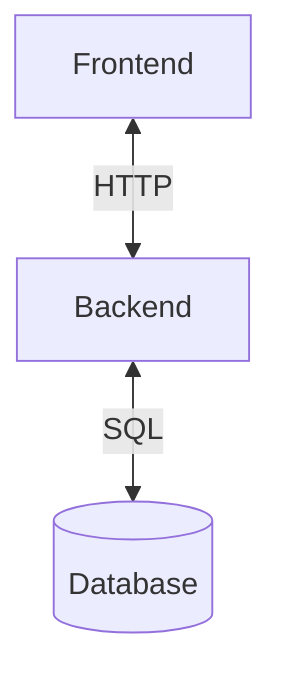
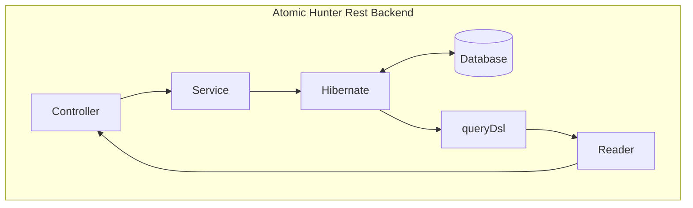
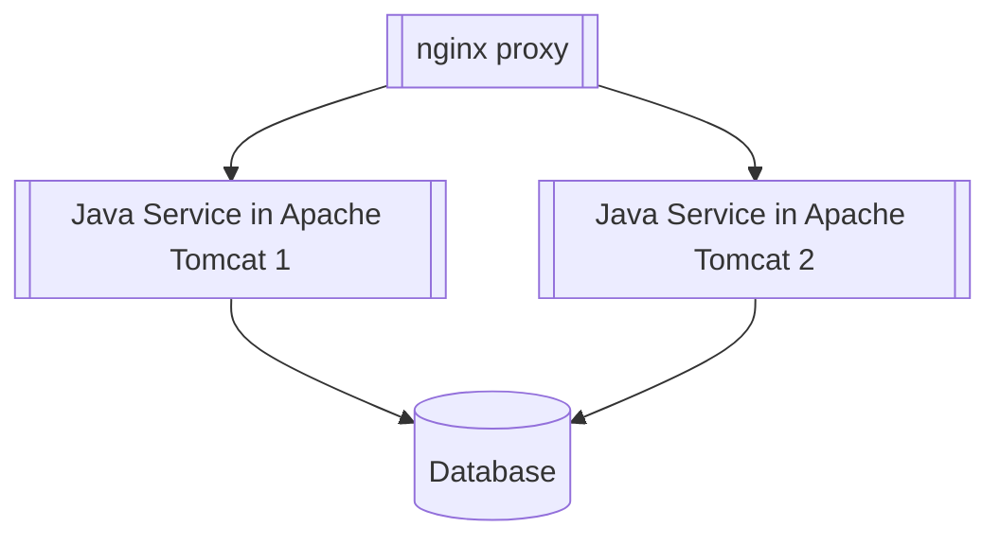
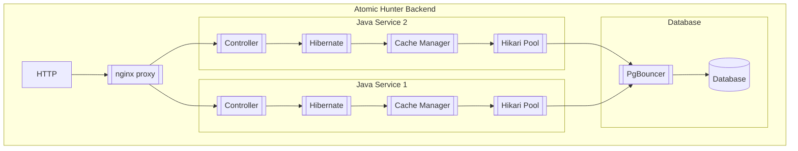

# Техническое описание системы

Система **Atomic Hunter** разработана в соответствии с трёхзвенной архитектурой. Данная система включает в себя клиентское веб-приложение и сервис, которые разработаны с помощью решений с открытым исходным кодом. Веб-приложение разработано c помощью веб-фреймворка **Angular 15**. Серверная часть представляет собой сервис, разработанный с помощью **Java 17** и фреймворка **Spring Boot 3**. Данный набор технологий обеспечивает кроссплатформенность приложения. Java-сервис может быть запущен на любой платформе, поддерживающей Java-машину. Клиентское веб-приложение может быть использовано на любом устройстве с браузером, в том числе на мобильном устройстве.

Веб приложение взаимодействует с сервисом с помощью протокола HTTP. Java-сервис имеет в своём составе REST API, с помощью которого обеспечиваются интеграционные возможности, что даёт возможности для дальнейшего масштабирования. 

---

## Описание backend 
Backend представлет собой сервис, разработанный с помощью языка программирования **Java 17** и фреймворка **Spring Boot 3**. Spring является одним из самых популярных фреймворков для создания корпоративных приложений. При этом он позволяет использовать не только языка программирования Java, но и Kotlin или Groovy. Spring состоит из отдельных модулей, каждый из которых предоставляет набор инструментов для решения технических задач, объединённых общей логикой Spring.

Вся бизнес-логика системы реализована на данном уровне. Взаимодействие с сервисом осуществляется с помощью REST API посредством протокола HTTP. Сервис взаимодействует с СУБД с помощью библиотеки объектно-реляционного отображения Hibernate. Данное решение реализует технологию, которая «соединяет» программные сущности и соответствующие записи в базе. Для написания запросов к базе используется надстройка над Hibernate в виде библиотеки queryDsl. Данная библиотека позволяет писать с помощью языка программирования Java запросы к базе похожие на язык SQL.

---
## Описание frontend
Клиентское веб-приложение представляется собой SPA (Single Page Application), которое разработано с помощью фреймворка **Angular 15**. Angular является открытой и свободной платформой для разработки веб-приложений, написанной на языке **TypeScript**, разрабатываемая сообществом разработчиков из различных компаний. 

В качестве визуальных компонентов в системе используется библиотека компонентов пользовательского интерфейса **PrimeNG**. Помимо **PrimeNG** в данной системе используется библиотека **AG-Grid** для работы с компонентами таблиц. Данная библиотека имеет 2 версии - community и enterprise. В данном проекте достаточно использования community версии. Enterprise-версия распространяется по подписке. Потребность в enterprise-версии имеет смысл только при использовании древовидных табличных представлений. Community-версия распространяется свободно и имеет открытый исходный код.

---
## Описание СУБД

Данная система работает с помощью СУБД PostgreSQL.

Структура данных разработана на основе ER-диаграммы представленной ниже.

---
## Масштабирование

Серверная часть приложения Atomic Hunter представляет собой Java-сервис, разработанный с помощью технологии Spring Boot. Java-сервис запускается с помощью Embedded Tomcat. Есть возможность запустить приложение в отдельном контейнере сервлетов Apache Tomcat. При обнаружении загрузки Tomcat на 80-90% предлагается параллельное использование нескольких серверов приложений, подключаемых к одной БД. Для организации доступа к нужному сервису предлагается использование nginx, который может выступать в качестве proxy и балансировщика нагрузки. При этом необходимо модифицировать сервис для организации хранения сессий пользователя в кэше. Кроме того, важно, чтобы сервисы своевремнно обновлялись, поскольку могут использовать базу данных по разному (например в случае изменения бизнес-логики или тп).

Между слоем сервиса и базой данных полезно использования кэширования. Данная технология реализуется из коробки на уровне ORM в Hibernate. Кроме того, обязательно использование пула соединений. На сегодняшний день стандартом в Spring Boot является Hikari Pool. Данная технология включена в Spring Boot приложении практически из коробки. Помимо использования пула соединений на стороне Java, есть возможность использования пула соединений на уровне PostgreSQL. Одним из таких инструментов является PgBouncer. Данный инструмент может поддерживать большое количество соединений, которые проксируются на несколько соединений непосредственно к PostgreSQL.
Кроме того, на уровне СУБД можно использовать технологию шардинга, но это потребует существенного перепроектирования. Целесообразние было бы использование технологии репликации. Например, можно настроить копии на нескольких серверах, один из серверов использовать для записи, а остальные при чтении данных. При манипуляциях с данными реплики, созданные для чтения, своевременно синхронизируются.

Еще одним вариантом масштабирования является использование брокера сообщений. На сегодняшний день самым популярным решением является Apache Kafka. Kafka реализует механизм очередей сообщений и является удобным решением для синхронизации микросервисов. В нашем случае нет микросервисной архитектуры, но брокер сообщений может быть полезен для использования именно механизма очередей. Например, пользователь сохраняет данные через новую транзакцию. Но вместо сохранения данных, можно отсылать эти данные в очередь. Даное сообщение будет получено одним из нескольких серверов осуществляющих обработку и сохранение в базу. Кроме того, можно возложить часть взаимодействий с внешним окружением через Apache Kafka. Например, можно не отправлять данные по HTTP через REST API в окружение, а положить для начала эти данные в очередь, а затем обработать это сообщение и уже вызвать внешний сервис по HTTP. Такая модель позволит продолжить выполнение бизнес-функционала приложений в случае, если внешнее окружение по каким-то причинам недоступно. В момент, когда сервис внешнего окружения восстановит свою работу, все сообщения будут обработаны и отправлены во внешний сервис.

Для дальнейшего масштабирования можно использовать технологию Docker. Слои приложения можно развернуть в Docker-контейнерах. Для оркестрации Docker-контейнерами можно использовать технологию kubernetes или swarm. Можно поднять несколько узлов c Docker и оркестрировать контейнеры между Docker-узлами. В Docker-контейнеры можно "упаковать" веб-приложение (nginx и сами исходники клиента), java-сервис(ы) (java, tomcat, jar-файл), nginx(proxy используемый как gateway), kafka, PostgreSQL. Данное решение также может упростить автоматизацию развёртывания приложения, а также оптимизировать управление архитектурой.

По мере роста инфраструктуры и требований к производительности может потребоваться увеличение мощностей. Соответственно, может потребоватьcя увеличение мощностей за счет увеличения ресурсов: процессоров, оперативной и постоянной памяти(SSD, HDD). При этом увеличение ресурсов может потребоваться только на конкретном узле (например, только на уровне СУБД или только на узле с Docker-конейнером Apache Kafka).

---